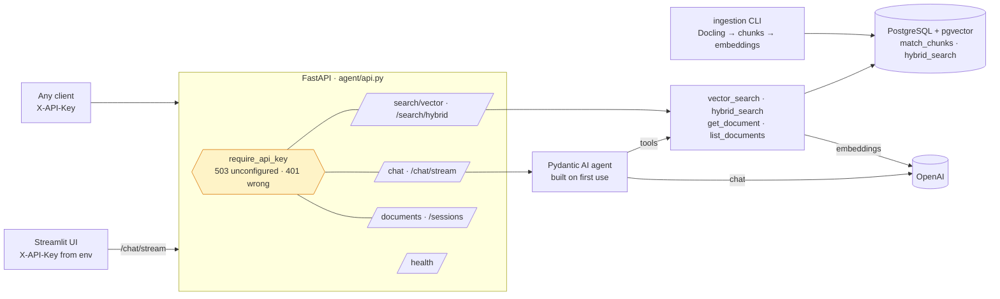
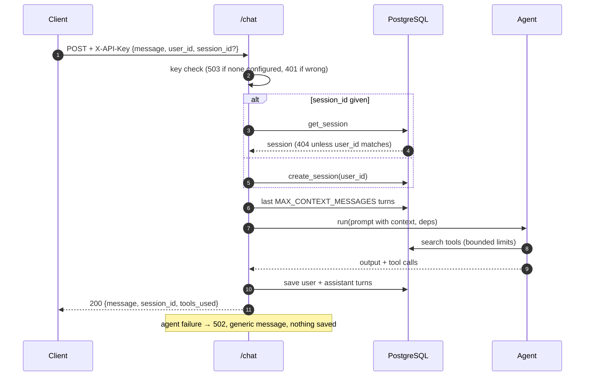

# Agentic RAG over pgvector

[](https://github.com/daniellopez882/ntt-rag-project/actions/workflows/ci.yml)


A FastAPI service that runs a [Pydantic AI](https://ai.pydantic.dev/) agent
with vector and hybrid search tools over documents stored in PostgreSQL +
pgvector, a Streamlit chat client, and an offline ingestion pipeline
(Docling PDF extraction → chunking → OpenAI embeddings). The corpus this
instance was built for is NTT DATA sustainability reports; nothing in the
code is specific to them beyond the system prompt.

> **Provenance.** The module layout (`agent/`, `ingestion/`, `sql/schema.sql`,
> the `AgentDependencies`/`providers` pattern) follows a widely shared public
> agentic-RAG example; this repository adapts it to a single PostgreSQL store
> and its own corpus, and the knowledge-graph half of that example is absent
> (its leftovers were still in the code). The changes below are documented
> against what was here.

## At a glance

| | |
|---|---|
| **Is** | An API (`/chat`, `/chat/stream`, `/search/vector`, `/search/hybrid`, `/documents`, `/sessions/{id}`, `/health`) + a UI + an ingestion CLI, in one package with three dependency groups |
| **Auth** | `X-API-Key` on every route but `/health`; **503 until a key is configured** (fails closed); CORS from `CORS_ORIGINS`; sessions bound to the caller that created them |
| **Tests** | 30 — API handlers with stubbed database functions and a fake agent; settings and input bounds; the ingestion pipeline with a fake extractor (3 tests need the `ingest` extra and run in their own CI job). No PostgreSQL, OpenAI or Docling needed |
| **CI** | ruff · `ruff format --check` · mypy · pytest · an import-with-no-secrets check · the ingest-extra tests · bandit · pip-audit · gitleaks · container: non-root image started against pgvector, migrates, `/health` true, 401 without the key, 200 with it |

## Architecture



### A chat request



## Getting started

```bash
uv sync --extra dev            # API + tests (small); add --extra ingest / --extra ui as needed
cp .env.example .env           # set DB_PASSWORD, API_KEY and OPENAI_API_KEY
docker compose up -d postgres api
curl -H "X-API-Key: $API_KEY" http://localhost:8058/documents
```

Ingest PDFs from `./documents`:

```bash
docker compose run --rm ingest --documents documents      # or: uv sync --extra ingest && python -m ingestion.ingest
```

UI: `docker compose up -d ui` → <http://localhost:8501>. Hot reload for
development: `docker compose -f docker-compose.yml -f docker-compose.dev.yml up`
(the old auto-loaded override mounted the tree over the image's virtualenv and
broke every `up`). Tests and checks:

```bash
uv run pytest -q && uv run ruff check . && uv run mypy agent
```

## Configuration

| Variable | Default | Notes |
|---|---|---|
| `API_KEY` | — | Required by every route but `/health`; unset ⇒ 503 |
| `CORS_ORIGINS` | — | Comma-separated browser origins; empty ⇒ none |
| `DB_USER` · `DB_PASSWORD` · `DB_HOST` · `DB_PORT` · `DB_NAME` | `postgres` · — · `postgres` · `5432` · `vector_db` | Or `DATABASE_URL` |
| `OPENAI_API_KEY` | — | Chat and embeddings; `/health` reports whether it is set |
| `LLM_CHOICE` · `EMBEDDING_MODEL` | `gpt-4o-mini` · `text-embedding-3-small` | |
| `MAX_MESSAGE_CHARS` · `MAX_CONTEXT_MESSAGES` · `SESSION_TIMEOUT_MINUTES` | `8000` · `10` · `60` | |
| `APP_ENV` · `LOG_LEVEL` · `APP_HOST` · `APP_PORT` | `development` · `INFO` · `0.0.0.0` · `8058` | |

## What changed, and why

| # | Defect | Effect |
|--:|---|---|
| 1 | No route authenticated; CORS `*` with credentials | Anyone reaching the port spent the OpenAI credit and read the corpus ([ADR 0001](docs/adr/0001-fail-closed-auth-and-caller-scoped-sessions.md)) |
| 2 | `/sessions/{id}` returned any session; `/chat` continued any session by id | Cross-talk between callers; sessions are bound to their creator now |
| 3 | `detail=str(e)` on every route; the global handler returned a Pydantic model, not a `Response` | Internals leaked to callers, and the handler itself crashed |
| 4 | `execute_agent` saved `"I encountered an error… <exception>"` as the assistant's turn | Failures became conversation history; now a 502 with nothing saved |
| 5 | `OPENAI_API_KEY` defaulted to the literal string `"LLM_API_KEY"` | A missing key surfaced as an authentication error from OpenAI at request time |
| 6 | Embedding client and agent built at import; Docling imported at the top of the extractor | `agent.api` could not be imported without an OpenAI key; the API image carried Docling and torch ([ADR 0002](docs/adr/0002-api-and-ingestion-are-separate-installs.md)) |
| 7 | `result.data` | Renamed to `.output` in the pinned pydantic-ai; the chat reply path used the old name |
| 8 | `HealthStatus.llm_connection = True` hard-coded | A health check that could not say no; it reports database, model and key configuration now |
| 9 | `limit`/`offset` unbounded on `/documents` and in the tool inputs; message length unbounded | Straight to `LIMIT`; one f-string `LIMIT` interpolation; a document id cast to `::uuid` without validation |
| 10 | Dockerfile on Python 3.11 for a project declaring `>=3.12,<3.13`; root user; everything installed everywhere | The build installed against an unsupported interpreter; one image for three roles |
| 11 | Streamlit, `requests` and `aiohttp` used but undeclared; the UI let users point the server at any URL | Worked by transitive luck; a server-side request proxy |
| 12 | A converter init failure was logged and swallowed; the chunker needed an OpenAI key even for recursive splitting; `IngestionResult` was built with fields it does not have | Ingestion failed later with unrelated errors |
| 13 | A global `filterwarnings("ignore")` at import; compose published PostgreSQL on the host with password `postgres` | Hidden warnings; an exposed database |
| 14 | No tests, no CI | Nothing checked anything |
| 15 | `docker-compose.override.yml` (auto-loaded) mounted the tree over `/app` and ran a bare `uvicorn` | Every `docker compose up` started an API container that died with *executable file not found*; the override is an explicit `docker-compose.dev.yml` now |

## Design notes

| Record | Decision |
|---|---|
| [ADR 0001](docs/adr/0001-fail-closed-auth-and-caller-scoped-sessions.md) | Fail-closed API-key auth; sessions belong to the caller who made them |
| [ADR 0002](docs/adr/0002-api-and-ingestion-are-separate-installs.md) | API, ingestion and UI are separate installs; providers built on first use |
| [Threat model](docs/threat-model.md) | Eight threats, what was open, what remains |

## Layout

```
agent/        api.py · agent.py · tools.py · db_utils.py · models.py · providers.py · prompts.py · config.py
ingestion/    ingest.py (CLI) · extract_files.py (Docling) · chunker.py
ui/app.py     Streamlit client
sql/          schema.sql (tables, pgvector functions)
tests/        API, settings/tools, ingestion
docs/         ADRs, threat model
Dockerfile · docker-compose.yml · pyproject.toml (base / ingest / ui / dev)
```

## Limits

- One API key for all callers; identities inside it are caller-asserted.
- Ingestion is an operator action against the database; there is no upload route.
- The Docling image is large even with CPU-only torch; CI runs its tests but does not build it.

## Licence

MIT — see [LICENCE](LICENCE).
